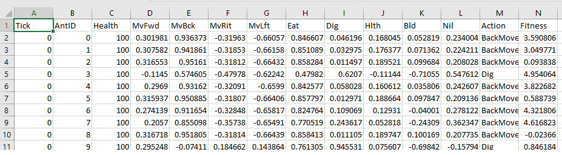

# Assignment 3: Antymology

This repository is an assignment for CPSC 565 (Emergent Computing) taken at the University of Calgary.

The objective of this assignment is to create a colony of ants that exhibit "intelligent" behaviour. The only goal of this assignment is to implement an evolutionary algorithm which maximizes nest production.

## Instructions
1. Download or Clone Repo
2. Open in Unity Editor

## The Simulation Environment
The world is made up of a number of worker ants and a single queen ant. Each ant can do the following:
- Move in any direction
- Eat mulch to restore health
- Donate health to a nearby ant
- Dig downwards
- Do nothing (Sometimes the only way to win the game is not to play)

Every "tick" of the simulation, each ant's health decreases by a pre-determined amount.

The queen ant can do everything the worker ant can do PLUS the ability to build nest blocks. However, building a nest block consumes 1/3 of the queens current health. Thus, the goal of building a nest becomes a balancing act between consuming health to build the nest and receiving enough health from other ants to stay alive.

## My Approach
To implement this system, I decided to use a neural network to determine the behaviors of the ants on every tick and an evolutionary algorithm to tweak the networks weights for the ants to "learn".

### Neural Network Ant Brains
Each tick the following inputs are fed into the neural network for each ant
- Ant's current health
- Number of Blocks Dug (or Number of Blocks built if it is the queen)
- Number of Mulch Eaten
- Amount of Health Donated
- Distance to Queen (or Distance to nearest neighbour if it is the queen)

My motivation for choosing these inputs, is that I hope for the ant's to eventually learn to maximize their own health while also donating health to others (more importantly donating health to the queen). I also hope that over time the ants learn to congregate around the queen (or maybe not, who knows what will happen, thats the fun of emergence).

The output layer corresponds to the set of all actions an ant can take. A value is generated between -1 and 1. These values are sorted, and the highest value decides the decision the ant will make. If the highest rated action is invalid (i.e. an ant is unable to move forward) then the next highest rated action will be taken, and so on and so forth.

### Antvolution
After a pre-determined number of ticks, the ants all undergo sexual reproduction. The two most fit ants are selected and a new set of NN weights are created using cross-over between the two most fit ants. All ants have their health replenished, stats reset and the new set of weights applied to their NN. For each NN there is also a chance for mutation, for a random set of weights to be adjusted. Then, the simulation starts over again.

The process of evolution for the queen is slightly different. Since there is only one queen in the simulation it does not make sense to sexually reproduce the queen with the other ants. Instead, the queen undergoes asexual reproduction where its offspring will mutate the weights of the previous generations weights. The extent of the mutation is conditional on the fitness of the queen. If the queen has high fitness, the mutation will be less severe.

#### Fitness Function

### Simulation Loop
The ants/queens are spawned into the world and go about their business until either a) it is time for evolution or b) the queen is dead (long live the queen). If it is time for evolution, new weights are calculated for each ant and then they keep doing what they are doing. If the queen is dead then the simulation resets but the neural networks weights are preserved. This way the ants can go through many iterations and hopefully, eventually learn how to keep their Ant Queen alive.

## Generated Data
Every simulation tick, the output layer of the neural network and fitness of each ant is captured in a CSV file called "AntTracker.csv" located in the "Assets" folder.

## Settings You Can Play With
In the Unity Editor there are some simulation settings you can play with in the "WorldManager" object.

Settings:
* 

## Controls
W,A,S,D - Move Camera
Space - Fly Camera Up
Ctrl - Fly Camera Down
Right Mouse Button - Rotate Camera

## External Resources
* Starting code base by Cooper Davies (https://github.com/DaviesCooper/Antymology)
* Script for creating Neural Network Diagram in GraphViz (https://github.com/martisak/dotnets)
* Neural Network Implementation in C# (https://towardsdatascience.com/building-a-neural-network-framework-in-c-16ef56ce1fef)
